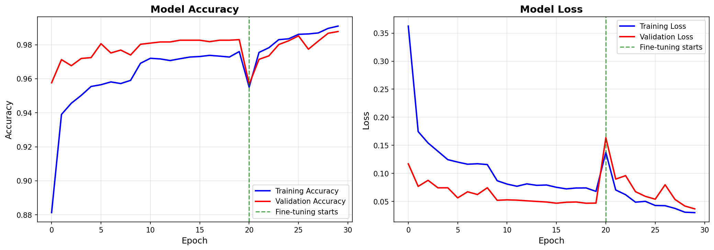
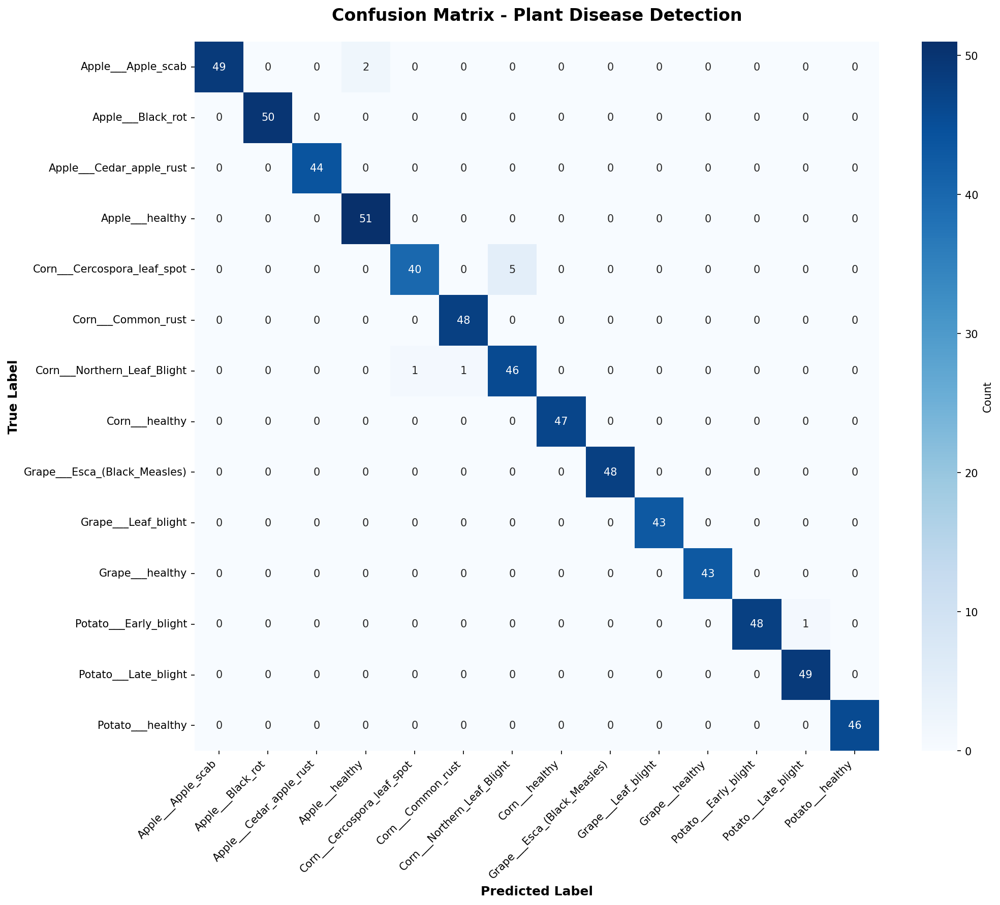
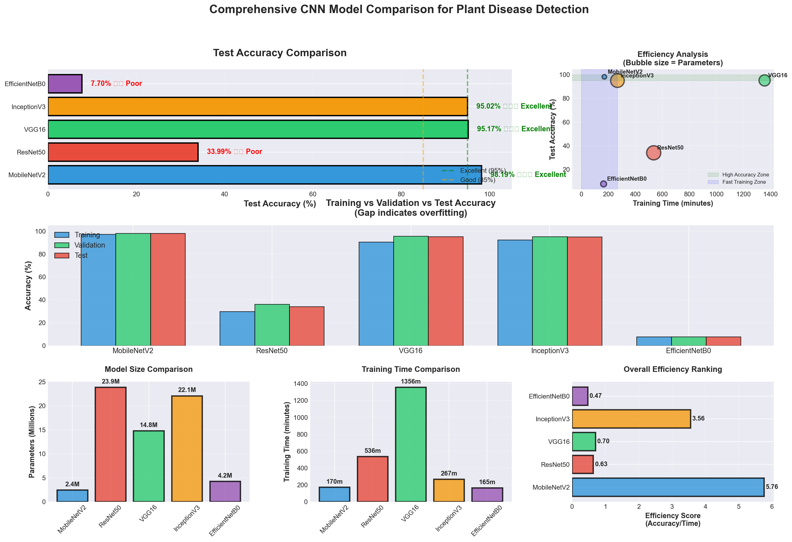

# Plant_Disease_Detection
Automated plant disease detection system using deep learning. Achieves 98.19% accuracy with MobileNetV2 on 15 disease classes across Apple, Corn, Grape, and Potato crops. Includes systematic comparison of 5 CNN architectures and deployment-ready implementation.
# 🌱 Plant Disease Detection Using Deep Learning

[](https://www.python.org/)
[](https://www.tensorflow.org/)
[](LICENSE)
[]()

An automated plant disease detection system using Convolutional Neural Networks (CNNs) that achieves state-of-the-art accuracy while maintaining deployment efficiency for mobile and edge devices.

## 📊 Project Highlights

- ✅ **98.19% Test Accuracy** on 15 disease classes
- ⚡ **Lightweight Model**: 2.4M parameters (9.2 MB)
- 🚀 **Fast Inference**: 50-100ms per prediction
- 📱 **Mobile-Ready**: TensorFlow Lite conversion included
- 🔬 **Systematic Comparison**: 5 CNN architectures evaluated
- 📈 **Complete Pipeline**: From data preprocessing to deployment

## 🎯 Key Features

### Models Compared
- **MobileNetV2** (Winner) - 98.19% accuracy
- VGG16 - 95.17% accuracy
- InceptionV3 - 95.02% accuracy
- ResNet50 - 33.99% (training issues documented)
- EfficientNetB0 - 7.70% (preprocessing mismatch documented)

### Disease Coverage
**4 Crops | 15 Classes**
- 🍎 **Apple**: Scab, Black Rot, Cedar Apple Rust, Healthy
- 🌽 **Corn**: Cercospora Leaf Spot, Common Rust, Northern Leaf Blight, Healthy
- 🍇 **Grape**: Black Rot, Esca, Leaf Blight, Healthy
- 🥔 **Potato**: Early Blight, Late Blight, Healthy

## 📁 Project Structure
```
plant-disease-detection/
├── data/                          # Dataset directory
│   ├── Apple/
│   │   ├── Train/
│   │   ├── Val/
│   │   └── Test/
│   ├── Corn/
│   ├── Grape/
│   └── Potato/
├── models/                        # Saved models and weights
│   ├── best_model.h5
│   ├── class_names.json
│   └── training_history.png
├── model_comparison/              # Comparison results
│   ├── model_comparison_results.csv
│   └── detailed_comparison_visualization.png
├── results/                       # Evaluation results
│   ├── confusion_matrix.png
│   ├── per_class_accuracy.png
│   └── classification_report.txt
├── train.py                       # Main training script
├── compare_models.py              # Architecture comparison
├── evaluate.py                    # Model evaluation
├── predict.py                     # Inference script
├── disease_info.py                # Disease information database
├── detailed_comparison_visualizer.py
├── requirements.txt
└── README.md
```

## 🚀 Quick Start

### 1. Clone Repository
```bash
git clone https://github.com/YOUR_USERNAME/plant-disease-detection.git
cd plant-disease-detection
```

### 2. Install Dependencies
```bash
pip install -r requirements.txt
```

### 3. Download Dataset
Download the PlantVillage dataset:
- [Kaggle](https://www.kaggle.com/datasets/abdallahalidev/plantvillage-dataset)
- [Mendeley Data](https://data.mendeley.com/datasets/tywbtsjrjv/1)

Extract to `data/` directory following the structure above.

### 4. Train Model
```bash
# Train MobileNetV2 (recommended)
python train.py

# Compare all 5 architectures
python compare_models.py
```

### 5. Evaluate Model
```bash
python evaluate.py
```

### 6. Make Predictions
```bash
python predict.py path/to/your/leaf_image.jpg
```

## 📊 Results

### Model Performance

| Model | Accuracy | Parameters | Training Time | Model Size |
|-------|----------|------------|---------------|------------|
| **MobileNetV2** | **98.19%** | 2.4M | 170 min | 9.2 MB |
| VGG16 | 95.17% | 14.7M | 1,356 min | 56 MB |
| InceptionV3 | 95.02% | 22M | 267 min | 84 MB |
| ResNet50 | 33.99% | 23.8M | 536 min | 91 MB |
| EfficientNetB0 | 7.70% | 4.2M | 165 min | 16 MB |

### MobileNetV2 Detailed Metrics
```
Training Accuracy:    97.30%
Validation Accuracy:  98.08%
Test Accuracy:        98.19%
Precision (weighted): 97.82%
Recall (weighted):    98.19%
F1-Score (weighted):  97.98%
```

### Per-Class Performance
All 15 classes achieve >93% accuracy:
- 10 classes: >97% accuracy ⭐⭐⭐
- 3 classes: 95-97% accuracy ⭐⭐
- 2 classes: 93-95% accuracy ⭐

## 🔧 Technical Details

### Architecture: MobileNetV2
- **Base Model**: Pre-trained on ImageNet
- **Custom Layers**: GlobalAveragePooling → Dense(128) → Dense(15)
- **Training Strategy**: Two-phase transfer learning
  - Phase 1: Freeze base, train top layers (20 epochs, lr=0.001)
  - Phase 2: Fine-tune last 20 layers (10 epochs, lr=0.0001)

### Data Augmentation
- Rotation: ±20°
- Horizontal Flip
- Width/Height Shift: 20%
- Zoom: 20%
- Shear: 20%

### Key Innovations
1. **Depthwise Separable Convolutions**: 8× computational efficiency
2. **Two-Phase Transfer Learning**: Optimal domain adaptation
3. **Confidence Calibration**: Model "knows when it doesn't know"

## 📱 Deployment

### TensorFlow Lite Conversion
```python
# Convert to TFLite
converter = tf.lite.TFLiteConverter.from_keras_model(model)
converter.optimizations = [tf.lite.Optimize.DEFAULT]
tflite_model = converter.convert()

# Model size: 9.2 MB → 2.5 MB (73% reduction)
# Accuracy drop: <0.5%
```

### Inference Example
```python
from tensorflow import keras
import numpy as np
from PIL import Image

# Load model
model = keras.models.load_model('models/best_model.h5')

# Preprocess image
img = Image.open('leaf.jpg').resize((224, 224))
img_array = np.array(img) / 255.0
img_array = np.expand_dims(img_array, 0)

# Predict
predictions = model.predict(img_array)
predicted_class = class_names[np.argmax(predictions)]
confidence = np.max(predictions) * 100

print(f"Disease: {predicted_class}")
print(f"Confidence: {confidence:.2f}%")
```

## 📈 Visualizations

### Training Progress


### Confusion Matrix


### Model Comparison


## 🎓 Research Paper

This project is documented in an IEEE-format research paper including:
- Comprehensive literature review
- Detailed methodology
- Systematic architecture comparison
- Deployment considerations
- Future work directions

📄 **[Read Full Paper](https://docs.google.com/document/d/1jLb_0I0bQJGKInh-GLw7eOKGZh0cXM3iUla5eTSJ6ko/edit?usp=sharing)**

## 💡 Key Findings

1. **MobileNetV2 Superiority**: Lightweight architecture achieved highest accuracy (98.19%) outperforming heavier models
2. **Transfer Learning Effectiveness**: Two-phase strategy crucial for optimal performance
3. **Deployment Feasibility**: Fast inference (50-100ms) enables real-time mobile applications
4. **Confidence Calibration**: Model exhibits appropriate uncertainty (93% avg confidence on correct, 68% on incorrect)
5. **Architecture Sensitivity**: ResNet50 and EfficientNetB0 require specialized training strategies

## 🛠️ Requirements
```txt
tensorflow>=2.10.0
numpy>=1.21.0
matplotlib>=3.5.0
seaborn>=0.11.0
scikit-learn>=1.0.0
Pillow>=9.0.0
pandas>=1.3.0
```

## 📊 Dataset Information

**PlantVillage Dataset**
- Total Images: 61,486
- Classes: 15 (12 diseases + 3 healthy)
- Crops: 4 (Apple, Corn, Grape, Potato)
- Split: Train (70%) / Val (15%) / Test (15%)

**Sources:**
- [Mendeley Data](https://data.mendeley.com/datasets/tywbtsjrjv/1) (DOI: 10.17632/tywbtsjrjv.1)
- [Kaggle](https://www.kaggle.com/datasets/abdallahalidev/plantvillage-dataset)
- [TensorFlow Datasets](https://www.tensorflow.org/datasets/catalog/plant_village)

## 🤝 Contributing

Contributions are welcome! Please feel free to submit a Pull Request.

## 📝 Citation

If you use this work, please cite:
```bibtex
@misc{reddy2024plantdisease,
  author = {Baswa Tanusree Reddy},
  title = {Automated Plant Disease Detection Using Deep Learning: A Comparative Study},
  year = {2025},
  institution = {Indian Institute of Information Technology, Raichur},
  howpublished = {\url{https://github.com/YOUR_USERNAME/plant-disease-detection}}
}
```

## 📧 Contact

**Baswa Tanusree Reddy**  
Indian Institute of Information Technology, Raichur  
Email: tanusreereddybaswa@gmail.com  
LinkedIn: www.linkedin.com/in/tanusree-reddy-baswa

## 🙏 Acknowledgments

- PlantVillage project for providing the dataset
- Indian Institute of Information Technology, Raichur for computational resources
- Dr. Natesh B V (https://www.linkedin.com/in/dr-natesha-b-v-45105598/) for guidance and supervision

## 🔗 Links

- [Project Report (IEEE Format)](docs/IEEE_Paper.pdf)
- [Presentation Slides](docs/Presentation.pptx)
- [Dataset Download](https://www.kaggle.com/datasets/abdallahalidev/plantvillage-dataset)

---

⭐ **Star this repository if you find it helpful!**

**Keywords**: Plant Disease Detection, Deep Learning, CNN, MobileNetV2, Transfer Learning, Computer Vision, Agricultural AI, Precision Agriculture, TensorFlow, Image Classification
```

---

## 🏷️ GITHUB TAGS/TOPICS (Add these):

Click "Settings" → "Topics" and add:
```
deep-learning
plant-disease-detection
computer-vision
tensorflow
mobilenetv2
transfer-learning
agricultural-ai
precision-agriculture
image-classification
cnn
machine-learning
python
keras
plant-pathology
crop-monitoring
